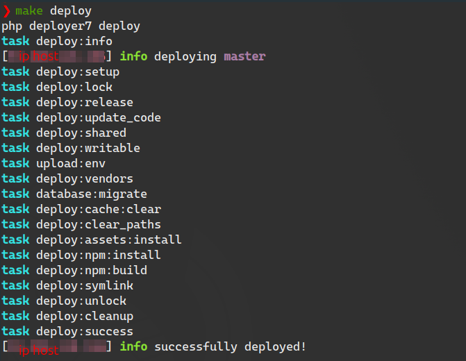

# Интернет магазин на Symfony

>  [Перейти на сайт](https://s-shop.alexanderyurchenko.ru/ "Перейти на сайт")

## Выберите язык

| Русский  | English                              | Español                              | 中文                              | Français                              | Deutsch                              |
|----------|--------------------------------------|--------------------------------------|---------------------------------|---------------------------------------|--------------------------------------|
| **Выбран** | [English](./docs/langs/README_en.md) | [Español](./docs/langs/README_es.md) | [中文](./docs/langs/README_zh.md) | [Français](./docs/langs/README_fr.md) | [Deutsch](./docs/langs/README_de.md) |

## Используемые технологии

* Nginx 1.26.1
* PHP 8.3.9
* Composer 2.7.7
* PostgreSQL 16.3
* npm 10.8.2

## О проекте

Этот проект реализует интернет магазин с использованием **Symfony v6.4.9**. Часть функционала выполнена на **Vue 2.6** для корзины и административной панели.

### Основной функционал

* Смена локали
* Консольные команды:
    * `php bin/console app:add-user` - создание пользователя
    * `php bin/console app:update-slug-product` - обновление слага продукта

### Фронтенд

* регистрация посетителей;
* личный кабинет;
* восстановление пароля;
* оформление заказа с уведомлениями по email;
* в проекте можно авторизоваться и/или зарегистрироваться, используя: Yandex, Google, GitHub или ВКонтакте.

### Административная часть

* управление заказами и пользователями;
* создание категорий;
* создание товаров;
* создание заказов.

## Установка проекта

1. Клонировать репозиторий: `git clone git@github.com:yaleksandr89/symfony-shop.git`.
2. Переименовать: `.env-example` в `.env`:
   * Настройте `ADMIN_EMAIL` / `MAILER_DSN` иначе не будет работать функционал восстановления пароля, а также процесс регистрации пользователя будет отрабатывать не до конца.
   * Настройте `OAUTH_GOOGLE_ID` / `OAUTH_GOOGLE_SECRET` - иначе не будет работать авторизация через Google.
   * Настройте `OAUTH_YANDEX_CLIENT_ID` / `OAUTH_YANDEX_CLIENT_SECRET` - иначе не будет работать авторизация через Яндекс.
   * Настройте `OAUTH_VK_CLIENT_ID` / `OAUTH_VK_CLIENT_SECRET` - иначе не будет работать авторизация через Вконтакте.
   * Настройте `OAUTH_GITHUB_EN_CLIENT_ID` / `OAUTH_GOOGLE_SECRET` - иначе не будет работать авторизация через Github (локаль локали: en).
   * Настройте `OAUTH_GITHUB_RUS_CLIENT_ID` / `OAUTH_GITHUB_RUS_CLIENT_SECRET` - иначе не будет работать авторизация через Github (локаль локали: ru).
   * Настройте `SITE_BASE_HOST` / `SITE_BASE_SCHEME` - иначе будут формироваться не корректные ссылки при регистрации, восстановлении пароле и ссылки которые находятся в письмах.
   * Настройте `APP_TIMEZONE` - указывает временную зону, которую будет использовать проект. По умолчанию `APP_TIMEZONE=Europe/Moscow`, если хотите использовать временную зону указанную в `php.ini` - оставьте эту переменную пустой.
3. Выполните: `composer i && npm i && npm run build`.
4. Создайте БД: `php bin/console doctrine:database:create` либо `symfony doctrine:database:create` (если установлена symfony cli).
   * На проекте используется `uuid_generate_v4` (используемая СуБД postgresql), поэтому перед миграцией, подключитесь к БД и выполните:
       * Подключитесь к выбранной БД (`\c ИМЯ СОЗДАННОЙ БД`).
       * `CREATE EXTENSION "uuid-ossp";`.
       * Для проверки можно выполнить `SELECT uuid_generate_v4();` - если в ответ сгенерировался uuid можно приступать к миграциям.
5. Выполните миграции: `php bin/console doctrine:migrations:migrate` либо `symfony doctrine:migrations:migrate` (если установлена symfony cli).
6. Выполните: `php bin/console assets:install` либо `symfony console assets:install` (если установлена symfony cli).
7. После этого сайт уже будет работать (открываться фронтовая часть), но для подключения к админке необходимо создать пользователя. Это можно сделать через созданную команду:
    * `php bin/console app:add-user` либо `symfony console app:add-user` (если установлена symfony cli).
    * Укажите email.
    * Укажите пароль (при вводе он отображаться не будет).
    * Укажите роль, для админа можно указать `ROLE_SUPER_ADMIN` (Доступные роли: `ROLE_SUPER_ADMIN`,`ROLE_ADMIN`,`ROLE_USER`).

## Настройка Messenger

Для отправки некоторых писем (восстановление пароля, подтверждение учетной записи) используется [Symfony Messenger](https://symfony.com/doc/current/components/messenger.html "Symfony Messenger"), поэтому необходимо запустить команду в терминале `symfony console messenger:consume async -vv`. Ручной запуск команды - целесообразен на этапе тестирования, когда все будет проверенно желательно или:

* повесить команду на `cron` 
* настроить `supervisor`

Пример конфига, который необходимо разместить `/etc/supervisor/conf.d/messenger-worker.conf`:

```
;/etc/supervisor/conf.d/messenger-worker.conf
[program:messenger-consume]
command=php /path/to/your/app/bin/console messenger:consume async --time-limit=3600
user=ubuntu
numprocs=2
startsecs=0
autostart=true
autorestart=true
process_name=%(program_name)s_%(process_num)02d
```

* `command=` - после `php` указать путь до консоли и через пробел, команду, которую надо добавить
* `user=` - указать текущего пользователя
* `numprocs=` - количество процессов, которые будут созданы

Остальные опции можно оставить без изменений. [Пример конфига](https://symfony.com/doc/6.4/messenger.html#supervisor-configuration) с официального сайта.

### Тестирование

Проект покрыт тестами различных типов (разбиты по группам `#[Group(name: '{name}')]`):

* unit
* integration
* functional
* functional-panther
* functional-selenium

Группы тестов 1. - 3. должны запускать без каких либо проблем `php ./vendor/bin/phpunit --testdox --group unit --group integration --group functional`. По последним двум группам
в процессе тестирования могут возникнуть проблемы из-за отсутствия установленного [chromedriver](drivers/chromedriver) - движок chrome или [geckodriver](drivers/geckodriver) - движок firefox. 


Исправить данные баги легко, для этого нужно:

* скачать движок: https://chromedriver.chromium.org/downloads (выбирать в зависимости от версии хрома). Можно попробовать воспользоваться движками, которые я разместил в проект в директории **drivers/**, но если версии движка и установленного браузера различаются - могут быть ошибки.
* Как установить движок в системе (linux) глобально: https://bangladroid.wordpress.com/2016/08/10/how-to-install-chrome-driver-in-linux-mint-selenium-webdriver/

После этого, перед началом тестирования, предварительно, нужно запустить selenium командой:

* `java -jar bin/selenium-server-4.22.0.jar standalone`
* `java -jar bin/selenium-server-standalone-3.141.59.jar` (не требует указания параметра standalone, но версия более старая)

Требует наличия java, в Ubuntu можно установить командой: `sudo apt install openjdk-21-jdk`, версия может отличаться - ставлю всегда последнюю


## Деплой с использованием Deployer 7

[Deployer 7](https://deployer.org/docs/7.x/getting-started) - это инструмент для автоматизации процесса деплоя приложений. Он позволяет определить задачи и последовательности действий для развертывания кода на удаленных серверах. В данном репозитории используется Deployer 7 для автоматизации деплоя.

### Настройка

Для использования Deployer 7 вам потребуется настроить файл `deploy.php`. Для этого переименуйте [deploy-example.php](deploy-example.php) в `deploy.php`, посмотрите оставленные комментарии и заполните файл согласно вашим потребностям. К **обязательному заполнению** относится раздел `//hosts`

```php
// Hosts
host('...')
    ->setHostname('...')
    ->setPort('...')
    ->setRemoteUser('...')
    ->setIdentityFile('~/.ssh/....pub')
    ->set('labels', ['stage' => 'prod'])
    ->set('branch', '...')
    ->set('deploy_path', '...');
```

### Использование

Для запуска в консоли выполните `php deployer7.phar deploy`, результат успешного деплоя будет выглядеть примерно так:



## UPD

* 08.07.2023 - удален конфиг `.circleci`. Перестал работать в России: https://support.circleci.com/hc/en-us/articles/360043679453-CircleCI-Terms-of-Service-Violation-Sanctioned-Country
* 08.07.2023 - Symfony обновлена до последней, на текущую дату, версию `6.3.1`
* 17.07.2024 - Symfony обновлена до версии `6.4.9`
* 17.07.2024 - Unit тесты обновлены до 11 версии, также отрефакторины сами тесты
* Добавлен конфиг для [nginx](docs/conf/nginx/s-shop.conf) и [supervisor](docs/conf/supervisor/messenger-worker.conf), а также различнее переводы для README.md
