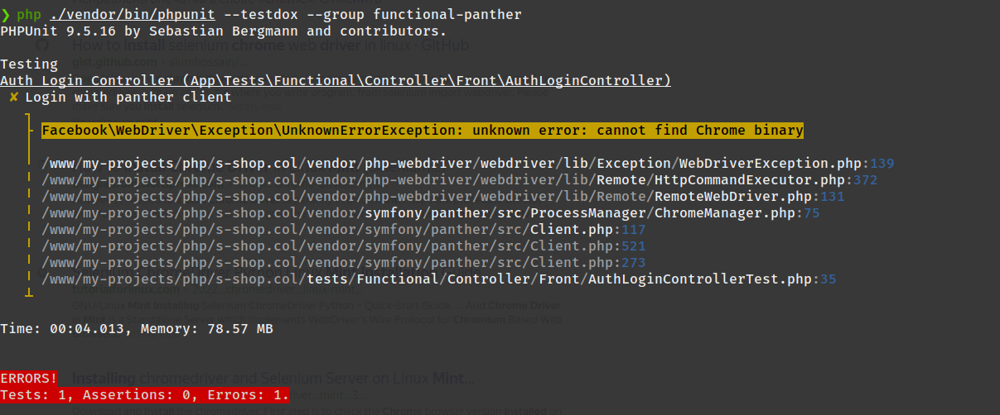

# Интернет магазин

```
Используется:
* PHP 8.2.7
* Composer 2.5.8
* Postgresql: 15.3
```

Реализация интернет магазина с использованием `Symfony 6`. Часть функционала сделана на `Vue 2.6` (реализация корзины, 
корзины в шапке и изменение товара в уже созданном заказе). Административная часть сайта - самописная. Из реализованного функционала:

* **Основное**:
  * Реализована смена локали.
* **Консоль**:
  * `php bin/console app:add-user` либо `symfony console app:add-user` (если установлена symfony cli) - консольное создание пользователя.
  * `php bin/console app:update-slug-product` либо `symfony console app:update-slug-product` (если установлена symfony cli) - обновление слага (пример: Название продукта "Красный коврик для мыши", после применения команды слаг станет "krasnyj-kovrik-dlya-myshi"). 
* **Фронт сайта**:
  * Регистрация посетителей.
  * Личный кабинет посетителей.
  * Восстановление пароля.
  * Заказ добавленных товаров (при заказе приходит email покупателю и менеджеру).
* **Административная часть сайта**:
  * Управление созданным заказом: создание и изменение текущего
  * Управление пользователям: создание и изменение текущего
  * Создание категорий / заказов

Функционал покрыт тестами.

## Процесс установки проекта

1. Клонировать репозиторий: `git clone git@github.com:yaleksandr89/symfony-shop.git`.
2. Переименовать: `.env-example` в `.env`.
3. Настроить БД.
4. Настройте `ADMIN_EMAIL` / `MAILER_DSN` иначе не будет работать функционал восстановления пароля, а также процесс регистрации пользователя будет отрабатывать не до конца.
5. Настройте `OAUTH_GOOGLE_ID` / `OAUTH_GOOGLE_SECRET` - иначе не будет работать авторизация через Google.
6. Настройте `OAUTH_YANDEX_CLIENT_ID` / `OAUTH_YANDEX_CLIENT_SECRET` - иначе не будет работать авторизация через Яндекс.
7. Настройте `OAUTH_VK_CLIENT_ID` / `OAUTH_VK_CLIENT_SECRET` - иначе не будет работать авторизация через Вконтакте.
8. Настройте `OAUTH_GITHUB_EN_CLIENT_ID` / `OAUTH_GOOGLE_SECRET` - иначе не будет работать авторизация через Github (локаль локали: en).
9. Настройте `OAUTH_GITHUB_RUS_CLIENT_ID` / `OAUTH_GITHUB_RUS_CLIENT_SECRET` - иначе не будет работать авторизация через Github (локаль локали: ru).
10. Настройте `SITE_BASE_HOST` / `SITE_BASE_SCHEME` - иначе будут формироваться не корректные ссылки при регистрации, восстановлении пароля и ссылки которые находятся в письмах.
11. Выполните: `composer i && npm i && npm run build`.
12. Создайте БД: `php bin/console doctrine:database:create` либо `symfony doctrine:database:create` (если установлена symfony cli).
13. На проекте используется `uuid_generate_v4`, поэтому перед миграцией, подключитесь к БД и выполните:
    * Подключитесь к выбранной БД (`\c ИМЯ СОЗДАННОЙ БД`).
    * `CREATE EXTENSION "uuid-ossp";`.
    * Для проверки можно выполнить `SELECT uuid_generate_v4();` - если в ответ сгенерировался uuid можно приступать к миграциям.
14. Выполните миграции: `php bin/console doctrine:migrations:migrate` либо `symfony doctrine:migrations:migrate` (если установлена symfony cli).
15. Выполните: `php bin/console assets:install` либо `symfony console assets:install` (если установлена symfony cli).
16. После этого сайт уже будет работать (открываться фронтовая часть), но для подключения к админке необходимо создать пользователя. Это можно сделать через созданную команду:
    * `php bin/console app:add-user` либо `symfony console app:add-user` (если установлена symfony cli).
    * Укажите email.
    * Укажите пароль (при вводе он отображаться не будет).
    * Укажите роль, для админа можно указать `ROLE_SUPER_ADMIN` (Доступные роли: `ROLE_SUPER_ADMIN`,`ROLE_ADMIN`,`ROLE_USER`).
17. Для отправки некоторых писем (восстановление пароля, подтверждение учетной записи) используется [Symfony Messenger](https://symfony.com/doc/current/components/messenger.html "Symfony Messenger"), поэтому необходимо запустить команду в терминале `symfony console messenger:consume async -vv` или повесить команду на крон или настроить `Supervisor`
```bash
;/etc/supervisor/conf.d/messenger-worker.conf
[program:messenger-consume]
command=php /path/to/your/app/bin/console messenger:consume async --time-limit=3600
user=ubuntu
numprocs=2
startsecs=0
autostart=true
autorestart=true
process_name=%(program_name)s_%(process_num)02d
```
* `command=` - после `php` указать путь до консоли и через пробел, команду, которую надо добавить
* `user=` - указать текущего пользователя
* `numprocs=` - количество процессов, которые будут созданы

Остальные опции можно оставить без изменений

>  [Перейти на сайт](https://s-shop.alexanderyurchenko.ru/ "Перейти на сайт")

## FAQ по теста реализованным на проекте

На проекте были реализованны различные типы тестирования (разбиты по группам `@group {name}`):

1. unit
2. integration
3. functional
4. functional-panther
5. functional-selenium

Группы тестов 1. - 3. должны запускать без каких либо проблем `php ./vendor/bin/phpunit --testdox --group unit,integration,functional`. По последним двум группам
в процессе тестирования могут возникнуть проблемы из-за отсутствия установленного `chromedriver`. 



Исправить данный баг достаточно легко, для этого нужно:
* скачать движок: https://chromedriver.chromium.org/downloads (выбирать в зависимости от версии хрома)
* Как установить движок в системе (linux) глобально: https://bangladroid.wordpress.com/2016/08/10/how-to-install-chrome-driver-in-linux-mint-selenium-webdriver/

После этого, перед началом тестирования, предварительно, нужно запустить selenium командой `java -jar bin/selenium-server-4.1.0.jar standalone`

## UPD

* 08.07.2023 - удален конфиг `.circleci`. Перестал работать в России: https://support.circleci.com/hc/en-us/articles/360043679453-CircleCI-Terms-of-Service-Violation-Sanctioned-Country
* 08.07.2023 - Symfony обновлена до последней, на текущую дату, версию `6.3.1`
