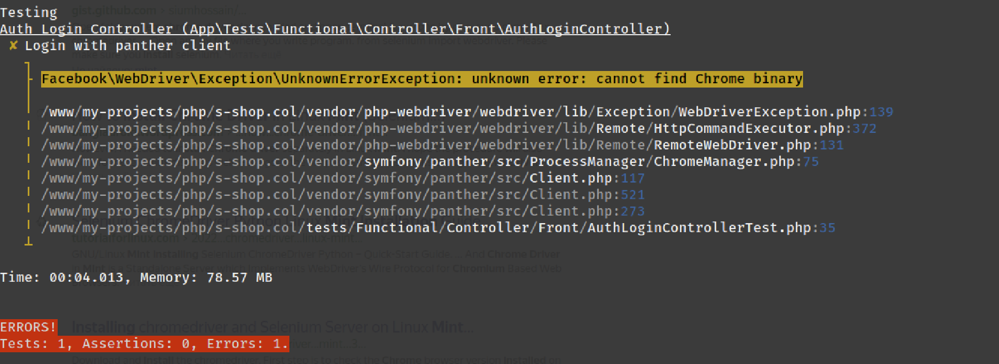
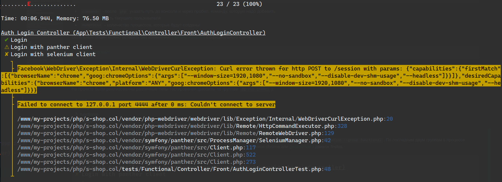
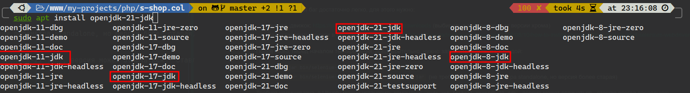
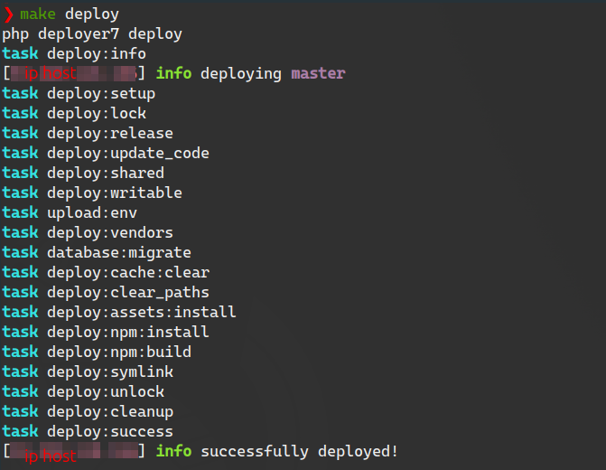

# Интернет магазин на Symfony

>  [Перейти на сайт](https://s-shop.alexanderyurchenko.ru/ "Перейти на сайт")

## Выберите язык

| Русский  | English                              | Español                              | 中文                              | Français                              | Deutsch                              |
|----------|--------------------------------------|--------------------------------------|---------------------------------|---------------------------------------|--------------------------------------|
| **Выбран** | [English](./docs/langs/README_en.md) | [Español](./docs/langs/README_es.md) | [中文](./docs/langs/README_zh.md) | [Français](./docs/langs/README_fr.md) | [Deutsch](./docs/langs/README_de.md) |

## Используемые технологии

* Nginx 1.26.1
* PHP 8.3.9
* Composer 2.7.7
* PostgreSQL 16.3
* npm 10.8.2

## О проекте

Этот проект реализует интернет магазин с использованием **Symfony v6.4.9**. Часть функционала выполнена на **Vue 2.6** для корзины и административной панели.

### Основной функционал

* Смена локали
* Консольные команды:
    * `php bin/console app:add-user` - создание пользователя
    * `php bin/console app:update-slug-product` - обновление слага продукта

### Фронтенд

* регистрация посетителей;
* личный кабинет;
* восстановление пароля;
* оформление заказа с уведомлениями по email;
* в проекте можно авторизоваться и/или зарегистрироваться, используя: Yandex, Google, GitHub или ВКонтакте.

### Административная часть

* управление заказами и пользователями;
* создание категорий;
* создание товаров;
* создание заказов.

## Установка проекта

1. Клонировать репозиторий: `git clone git@github.com:yaleksandr89/symfony-shop.git`.
2. Создать локальную конфигурацию Docker: `make init`. Команда создаст игнорируемый `.env.docker` из `.env.docker.example`.
3. Выполнить начальную настройку проекта в Docker:

   ```bash
   make build
   make up
   make composer-install
   make npm-install
   make assets-build
   make migrate
   make demo-init
   ```

4. После завершения настройки сайт доступен на порту из `APP_PORT`. Для доступа к административной части создайте пользователя:

   ```bash
   make console CMD='app:add-user'
   ```

### Конфигурация окружения

* `.env` хранится в Git и содержит безопасные общие настройки приложения, включая режим разработки и локальные демонстрационные значения.
* `.env.docker` игнорируется Git и содержит только настройки Docker Compose, PostgreSQL и параметры подключения браузерных тестов.
* Реальные локальные секреты, учётные данные OAuth и настройки почты при необходимости добавляйте в игнорируемый `.env.local`.
* `.env.test` используется автоматическими тестами и содержит только тестовые переопределения.
* `.env.prod`, `.env-example` и `.env.panther` больше не используются.
* Стратегия боевого окружения и развёртывания на VDS будет описана отдельным этапом.

Приложение в браузере получает общие настройки из `.env`. Локальные переопределения, включая временную смену `APP_ENV`, `APP_DEBUG` и `APP_SECRET`, задавайте в `.env.local`, а не в `.env.docker`.

### Приоритет переменных окружения

Symfony использует значения в следующем порядке — от более высокого приоритета к более низкому:

1. Реальные переменные окружения контейнера. В локальном Docker-окружении они передаются из `.env.docker`.
2. `.env.<окружение>.local`, например `.env.dev.local`.
3. `.env.<окружение>`, например `.env.test`.
4. `.env.local`.
5. `.env`.

Название `.env.docker` само по себе не даёт файлу особого приоритета. Docker Compose читает его при создании контейнеров и передаёт значения внутрь контейнера как реальные переменные окружения, поэтому Symfony уже не заменяет их значениями из `.env.local` или `.env`.

В окружении `test` файл `.env.local` не применяется. Тестовые переопределения находятся в `.env.test`, а переменные, переданные контейнеру из `.env.docker`, всё равно имеют более высокий приоритет.

Примеры:

* `MESSENGER_TRANSPORT_DSN` из `.env.local` перекроет значение из `.env`, если эта переменная отсутствует в `.env.docker`.
* `PANTHER_WEB_SERVER_PORT` из `.env.local` не перекроет значение из `.env.docker`, потому что Docker уже передал его контейнеру как реальную переменную окружения.
* Для локальных секретов и настроек конкретного разработчика используйте `.env.local`.
* После изменения `.env` или `.env.local` контейнер обычно пересоздавать не требуется.
* После изменения `.env.docker` пересоздайте контейнеры командой `make down && make up`.


## Настройка Messenger

Для отправки некоторых писем (восстановление пароля, подтверждение учетной записи) используется [Symfony Messenger](https://symfony.com/doc/current/components/messenger.html "Symfony Messenger"), поэтому необходимо запустить команду в терминале `symfony console messenger:consume async -vv`. Ручной запуск команды - целесообразен на этапе тестирования, когда все будет проверенно желательно или:

* повесить команду на `cron` 
* настроить `supervisor`

Пример конфига, который необходимо разместить `/etc/supervisor/conf.d/messenger-worker.conf`:

```
;/etc/supervisor/conf.d/messenger-worker.conf
[program:messenger-consume]
command=php /path/to/your/app/bin/console messenger:consume async --time-limit=3600
user=ubuntu
numprocs=2
startsecs=0
autostart=true
autorestart=true
process_name=%(program_name)s_%(process_num)02d
```

* `command=` - после `php` указать путь до консоли и через пробел, команду, которую надо добавить
* `user=` - указать текущего пользователя
* `numprocs=` - количество процессов, которые будут созданы

Остальные опции можно оставить без изменений. [Пример конфига](https://symfony.com/doc/6.4/messenger.html#supervisor-configuration) с официального сайта.

### Тестирование

Проект покрыт тестами различных типов (разбиты по группам `#[Group(name: '{name}')]`):

* unit
* integration
* functional
* functional-panther
* functional-selenium

Группы тестов 1. - 3. должны запускать без каких либо проблем `php ./vendor/bin/phpunit --testdox --group unit --group integration --group functional`. По последним двум группам
в процессе тестирования могут возникнуть проблемы из-за отсутствия установленного [chromedriver](bin/drivers/chromedriver) - движок chrome или [geckodriver](bin/drivers/geckodriver) - движок firefox.





Исправить данные баги легко, для этого нужно:

* скачать движок: https://chromedriver.chromium.org/downloads (выбирать в зависимости от версии хрома). Можно попробовать воспользоваться движками, которые я разместил в проект в директории **bin/drivers/**, но если версии движка и установленного браузера различаются - могут быть ошибки.
* Как установить движок в системе (linux) глобально: https://bangladroid.wordpress.com/2016/08/10/how-to-install-chrome-driver-in-linux-mint-selenium-webdriver/

В Docker-сценарии Selenium запускается как Docker Compose service. Для запуска functional-selenium тестов используйте:

* `make test-functional-selenium`

Для Docker Selenium tests используют compose service `selenium` и `SELENIUM_SERVER_URL=http://selenium:4444/wd/hub`; Panther web server доступен внутри compose network как `php:9080`.

При необходимости Selenium service можно проверить отдельно:

* `docker compose -p symfony-shop --env-file .env.docker up -d selenium`
* `curl -fsS http://127.0.0.1:4444/status`

Для Docker-сценария Java на хосте не нужна. Ручной запуск через локальный JAR можно использовать только как fallback вне Docker:

* `java -jar bin/selenium-server.jar standalone`

Требует наличия java, в Ubuntu можно установить командой: `sudo apt install openjdk-21-jdk`, версия может отличаться - ставлю всегда последнюю



## Деплой с использованием Deployer 7

[Deployer 7](https://deployer.org/docs/7.x/getting-started) - это инструмент для автоматизации процесса деплоя приложений. Он позволяет определить задачи и последовательности действий для развертывания кода на удаленных серверах. В данном репозитории используется Deployer 7 для автоматизации деплоя.

### Настройка

Для использования Deployer 7 вам потребуется настроить файл `deploy.php`. Для этого переименуйте [deploy-example.php](deploy-example.php) в `deploy.php`, посмотрите оставленные комментарии и заполните файл согласно вашим потребностям. К **обязательному заполнению** относится раздел `//hosts`

```php
// Hosts
host('...')
    ->setHostname('...')
    ->setPort('...')
    ->setRemoteUser('...')
    ->setIdentityFile('~/.ssh/....pub')
    ->set('labels', ['stage' => 'prod'])
    ->set('branch', '...')
    ->set('deploy_path', '...');
```

### Использование

Для запуска в консоли выполните `php deployer7.phar deploy`, результат успешного деплоя будет выглядеть примерно так:



## UPD

* 08.07.2023 - удален конфиг `.circleci`. Перестал работать в России: https://support.circleci.com/hc/en-us/articles/360043679453-CircleCI-Terms-of-Service-Violation-Sanctioned-Country
* 08.07.2023 - Symfony обновлена до последней, на текущую дату, версию `6.3.1`
* 17.07.2024 - Symfony обновлена до версии `6.4.9`
* 17.07.2024 - Unit тесты обновлены до 11 версии, также отрефакторины сами тесты
* Добавлен конфиг для [nginx](docs/conf/nginx/s-shop.conf) и [supervisor](docs/conf/supervisor/messenger-worker.conf), а также различнее переводы для README.md
