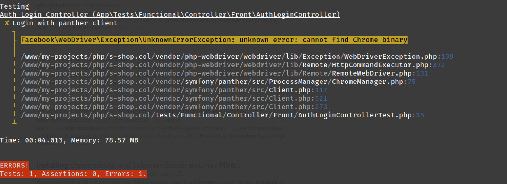
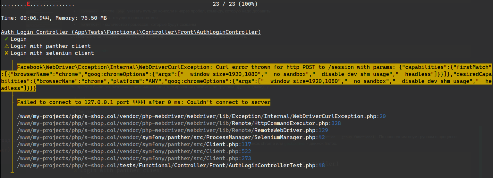
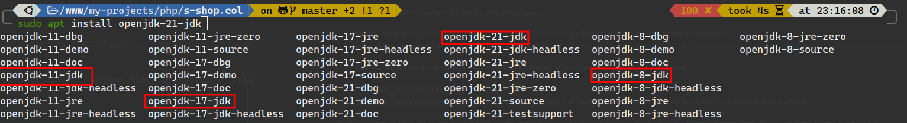

# Symfony Online Store

> [Go to the website](https://s-shop.alexanderyurchenko.ru "Go to the website")

## Choose a language

| Русский                    | English      | Español                              | 中文                              | Français                              | Deutsch                              |
|----------------------------|--------------|--------------------------------------|---------------------------------|---------------------------------------|--------------------------------------|
| [Русский](../../README.md) | **Selected** | [Español](./docs/langs/README_es.md) | [中文](./docs/langs/README_zh.md) | [Français](./docs/langs/README_fr.md) | [Deutsch](./docs/langs/README_de.md) |

## Technologies used

* Nginx 1.26.1
* PHP 8.3.9
* Composer 2.7.7
* PostgreSQL 16.3
* npm 10.8.2

## About the project

This project implements an online store using **Symfony v6.4.9**. Some of the functionality is implemented in **Vue 2.6** for the shopping cart and the administrative panel.

### Basic functionality

* Change of locale
* Console commands:
    * `php bin/console app:add-user` - create a user
    * `php bin/console app:update-slug-product` - product slug update

### Frontend

* registration of visitors;
* personal account;
* Password recovery;
* placing an order with email notifications;
* you can log in to the project and/or register using: Yandex, Google, GitHub or VKontakte.

### Administrative part

* Order and user management;
* creating categories;
* Product creation;
* create orders.

## Project Installation

1. Clone the repository: `git clone git@github.com:yaleksandr89/symfony-shop.git`.
2. Rename: `.env-example` to `.env`:
    * Configure `ADMIN_EMAIL` / `MAILER_DSN` otherwise the password recovery functionality will not work, and the user registration process will not work out to the end.
        * Configure `OAUTH_GOOGLE_ID` / `OAUTH_GOOGLE_SECRET` - otherwise, authorization via Google will not work.
        * Configure `OAUTH_YANDEX_CLIENT_ID` / `OAUTH_YANDEX_CLIENT_SECRET` - otherwise authorization via Yandex will not work.
        * Configure `OAUTH_VK_CLIENT_ID` / `OAUTH_VK_CLIENT_SECRET` - otherwise, authorization via Vkontakte will not work.
        * Configure `OAUTH_GITHUB_EN_CLIENT_ID` / `OAUTH_GOOGLE_SECRET` - otherwise authorization via Github will not work (locale: en).
        * Configure `OAUTH_GITHUB_RUS_CLIENT_ID` / `OAUTH_GITHUB_RUS_CLIENT_SECRET' - otherwise authorization via Github will not work (locale: ru).
        * Configure `SITE_BASE_HOST` / `SITE_BASE_SCHEME' - otherwise incorrect links will be generated during registration, password recovery and links that are in emails.
        * Configure `APP_TIMEZONE` - specifies the time zone that the project will use. By default, `APP_TIMEZONE=Europe/Moscow`, if you want to use the time zone specified in `php.ini`, leave this variable empty.
3. Run: `composer i&& npm i && npm run build'.
4. Create a database: `php bin/console doctrine:database:create` or `symfony doctrine:database:create` (if symfony cli is installed).
    * The project uses `uuid_generate_v4` (used by postgresql DBMS), so before migrating, connect to the database and run:
        * Connect to the selected database (`\c NAME OF THE CREATED DATABASE`).
        * `CREATE EXTENSION "uuid-ossp";`.
        * To check, you can run `SELECT uuid_generate_v4();` - if a uuid is generated in response, you can start migrations.
5. Perform migrations: `php bin/console doctrine:migrations:migrate` or `symfony doctrine:migrations:migrate` (if symfony cli is installed).
6. Perform: `php bin/console assets:install` or `symfony console assets:install` (if symfony cli is installed).
7. After that, the site will already be working (the front part opens), but to connect to the admin panel, you need to create a user. This can be done through the created command:
    * `php bin/console app:add-user` or `symfony console app:add-user` (if symfony cli is installed).
        * Specify the email address.
        * Enter the password (it will not be displayed when you enter it).
        * Specify the role, for the admin you can specify `ROLE_SUPER_ADMIN` (Available roles: `ROLE_SUPER_ADMIN`, `ROLE_ADMIN`,`ROLE_USER`).

## Setting up Messenger

[Symfony Messenger] is used to send some emails (password recovery, account confirmation) (https://symfony.com/doc/current/components/messenger.html "Symfony Messenger"), so you need to run the command in the terminal `symfony console messenger:consume async -vv`. Manually running the command is advisable at the testing stage, when everything is verified, desirable or:

* hang the command on the `cron`
* set up the `supervisor`

Example of a config to be placed `/etc/supervisor/conf.d/messenger-worker.conf`:

```
;/etc/supervisor/conf.d/messenger-worker.conf
[program:messenger-consume]
command=php /path/to/your/app/bin/console messenger:consume async --time-limit=3600
user=ubuntu
numprocs=2
startsecs=0
autostart=true
autorestart=true
process_name=%(program_name)s_%(process_num)02d
```

* `command=` - after `php` specify the path to the console and, separated by a space, the command to be added
* `user=` - specify the current user
* `numprocs=` - the number of processes to be created

The other options can be left unchanged. [Config example](https://symfony.com/doc/6.4/messenger.html#supervisor-configuration ) from the official website.

### Testing

The project is covered with tests of various types (divided into groups `#[Group(name: '{name}')]`):

* unit
* integration
* functional
* functional-panther
* functional-selenium

Test groups 1. - 3. should run without any problems `php ./vendor/bin/phpunit --testdox --group unit --group integration --group functional'. For the last two groups
, problems may arise during testing due to the lack of an installed [chromedriver](../../drivers/chromedriver) - chrome engine or [geckodriver](../../drivers/geckodriver) - firefox engine.





It is easy to fix these bugs, for this you need:

* download the engine: https://chromedriver.chromium.org/downloads (choose depending on the chrome version). You can try to use the engines that I have placed in the project in the **drivers/** directory, but if the versions of the engine and the installed browser differ, there may be errors.
* How to install the engine on a system (linux) globally: https://bangladroid.wordpress.com/2016/08/10/how-to-install-chrome-driver-in-linux-mint-selenium-webdriver/

After that, before starting testing, you first need to run selenium with the command:

* `java -jar bin/selenium-server-4.22.0.jar standalone`
* `java -jar bin/selenium-server-standalone-3.141.59.jar` (does not require the standalone parameter, but the version is older)

Requires java, in Ubuntu you can install the command: `sudo apt install openjdk-21-jdk`, the version may vary - I always put the latest



## UPD

* 07/08/2023 - the `.circleci` config has been removed. I stopped working in Russia: https://support.circleci.com/hc/en-us/articles/360043679453-CircleCI-Terms-of-Service-Violation-Sanctioned-Country
* 07/08/2023 - Symfony updated to the latest, as of the current date, version `6.3.1`
* 07/17/2024 - Symfony updated to version `6.4.9`
* 07/17/2024 - Unit tests updated to version 11, the tests themselves are also refactored
* Added config for [nginx](../conf/nginx/s-shop.conf) and [supervisor](../conf/supervisor/messenger-worker.conf), as well as different translations for README.md