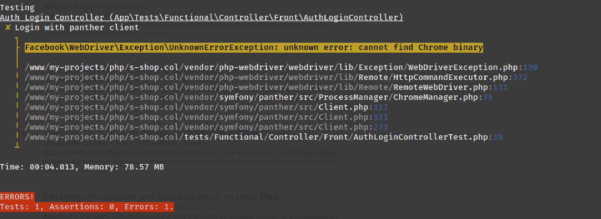

# Tienda en línea en Symfony

> [Visitar el sitio](https://s-shop.alexanderyurchenko.ru/ "Visitar el sitio")

## Seleccione el idioma

| Русский                              | English                              | Español                              | 中文                              | Français                              | Deutsch                              |
|--------------------------------------|--------------------------------------|--------------------------------------|---------------------------------|---------------------------------------|--------------------------------------|
| [Русский](../../README.md) | [English](./docs/langs/README_en.md) | **Seleccionado** | [中文](./docs/langs/README_zh.md) | [Français](./docs/langs/README_fr.md) | [Deutsch](./docs/langs/README_de.md) |

## Tecnologías utilizadas

* Nginx 1.26.1
* PHP 8.3.9
* Composer 2.7.7
* PostgreSQL 16.3
* npm 10.8.2

## Acerca del proyecto

Este proyecto implementa una tienda en línea utilizando **Symfony v6.4.9**. Parte de la funcionalidad se realiza con **Vue 2.6** para el carrito y el panel administrativo.

### Funcionalidad principal

* Cambio de localización
* Comandos de consola:
    * `php bin/console app:add-user` - creación de usuario
    * `php bin/console app:update-slug-product` - actualización del slug del producto

### Frontend

* registro de visitantes;
* cuenta personal;
* recuperación de contraseña;
* realización de pedidos con notificaciones por correo electrónico;
* en el proyecto se puede autenticar y/o registrar usando: Yandex, Google, GitHub o VKontakte.

### Parte administrativa

* gestión de pedidos y usuarios;
* creación de categorías;
* creación de productos;
* creación de pedidos.

## Instalación del proyecto

1. Clonar el repositorio: `git clone git@github.com:yaleksandr89/symfony-shop.git`.
2. Renombrar: `.env-example` a `.env`:
    * Configure `ADMIN_EMAIL` / `MAILER_DSN` de lo contrario no funcionará la recuperación de contraseñas y el proceso de registro de usuario no se completará.
    * Configure `OAUTH_GOOGLE_ID` / `OAUTH_GOOGLE_SECRET` - de lo contrario no funcionará la autenticación a través de Google.
    * Configure `OAUTH_YANDEX_CLIENT_ID` / `OAUTH_YANDEX_CLIENT_SECRET` - de lo contrario no funcionará la autenticación a través de Yandex.
    * Configure `OAUTH_VK_CLIENT_ID` / `OAUTH_VK_CLIENT_SECRET` - de lo contrario no funcionará la autenticación a través de VKontakte.
    * Configure `OAUTH_GITHUB_EN_CLIENT_ID` / `OAUTH_GITHUB_SECRET` - de lo contrario no funcionará la autenticación a través de GitHub (localización: en).
    * Configure `OAUTH_GITHUB_RUS_CLIENT_ID` / `OAUTH_GITHUB_RUS_CLIENT_SECRET` - de lo contrario no funcionará la autenticación a través de GitHub (localización: ru).
    * Configure `SITE_BASE_HOST` / `SITE_BASE_SCHEME` - de lo contrario se generarán enlaces incorrectos durante el registro, recuperación de contraseña y enlaces en los correos.
    * Configure `APP_TIMEZONE` - indica la zona horaria que usará el proyecto. Por defecto `APP_TIMEZONE=Europe/Moscow`, si desea usar la zona horaria indicada en `php.ini` - deje esta variable vacía.
3. Ejecute: `composer i && npm i && npm run build`.
4. Cree la base de datos: `php bin/console doctrine:database:create` o `symfony doctrine:database:create` (si tiene instalada la CLI de Symfony).
    * El proyecto utiliza `uuid_generate_v4` (base de datos PostgreSQL), así que antes de la migración, conéctese a la base de datos y ejecute:
        * Conéctese a la base de datos elegida (`\c NOMBRE_DE_LA_BD`).
        * `CREATE EXTENSION "uuid-ossp";`.
        * Para comprobar, ejecute `SELECT uuid_generate_v4();` - si se genera un uuid como respuesta, puede proceder con las migraciones.
5. Ejecute las migraciones: `php bin/console doctrine:migrations:migrate` o `symfony doctrine:migrations:migrate` (si tiene instalada la CLI de Symfony).
6. Ejecute: `php bin/console assets:install` o `symfony console assets:install` (si tiene instalada la CLI de Symfony).
7. Después de esto, el sitio ya debería funcionar (se abrirá la parte frontal), pero para acceder al panel de administración, debe crear un usuario. Esto se puede hacer con el comando creado:
    * `php bin/console app:add-user` o `symfony console app:add-user` (si tiene instalada la CLI de Symfony).
    * Indique el email.
    * Indique la contraseña (no se mostrará al ingresar).
    * Indique el rol, para administrador puede usar `ROLE_SUPER_ADMIN` (Roles disponibles: `ROLE_SUPER_ADMIN`, `ROLE_ADMIN`, `ROLE_USER`).

## Configuración de Messenger

Para el envío de algunos correos (recuperación de contraseña, confirmación de cuenta) se utiliza [Symfony Messenger](https://symfony.com/doc/current/components/messenger.html "Symfony Messenger"), por lo que es necesario ejecutar el comando en el terminal `symfony console messenger:consume async -vv`. Ejecutar el comando manualmente es adecuado en la fase de pruebas, pero una vez que todo esté verificado, es preferible:

* Colgar el comando en `cron`
* Configurar `supervisor`

Ejemplo de configuración, que debe ubicarse en `/etc/supervisor/conf.d/messenger-worker.conf`:

```
;/etc/supervisor/conf.d/messenger-worker.conf
[program:messenger-consume]
command=php /path/to/your/app/bin/console messenger:consume async --time-limit=3600
user=ubuntu
numprocs=2
startsecs=0
autostart=true
autorestart=true
process_name=%(program_name)s_%(process_num)02d
```

* `command=` - después de `php` indique la ruta a la consola y el comando que debe ejecutar
* `user=` - indique el usuario actual
* `numprocs=` - cantidad de procesos que se crearán

Las demás opciones se pueden dejar sin cambios. [Ejemplo de configuración](https://symfony.com/doc/6.4/messenger.html#supervisor-configuration) del sitio oficial.

### Pruebas

El proyecto está cubierto por varios tipos de pruebas (agrupadas por `#[Group(name: '{name}')]`):

* unitarias
* de integración
* funcionales
* funcionales-panther
* funcionales-selenium

Las pruebas de los grupos 1 - 3 deberían ejecutarse sin problemas `php ./vendor/bin/phpunit --testdox --group unit --group integration --group functional`. Para los dos últimos grupos, pueden surgir problemas durante las pruebas debido a la falta de [chromedriver](../../drivers/chromedriver) - motor de Chrome o [geckodriver](../../drivers/geckodriver) - motor de Firefox.




Estos errores son fáciles de corregir, simplemente descargue el motor: https://chromedriver.chromium.org/downloads (elija según la versión de Chrome). Puede intentar usar los motores que he colocado en el proyecto en el directorio **drivers/**, pero si las versiones del motor y el navegador instalado son diferentes, pueden surgir errores.
Cómo instalar el motor en el sistema (Linux) globalmente: https://bangladroid.wordpress.com/2016/08/10/how-to-install-chrome-driver-in-linux-mint-selenium-webdriver/

Después de esto, antes de comenzar las pruebas, debe iniciar selenium con el comando:

* `java -jar bin/selenium-server-4.22.0.jar standalone`
* `java -jar bin/selenium-server-standalone-3.141.59.jar` (no requiere especificar el parámetro standalone, pero la versión es más antigua)

Requiere tener Java, en Ubuntu puede instalarlo con el comando: `sudo apt install openjdk-21-jdk`, la versión puede variar - siempre instalo la última.


## UPD

* 08.07.2023 - eliminado el archivo de configuración `.circleci`. Dejó de funcionar en Rusia: https://support.circleci.com/hc/en-us/articles/360043679453-CircleCI-Terms-of-Service-Violation-Sanctioned-Country
* 08.07.2023 - Symfony actualizado a la última versión disponible en esta fecha `6.3.1`
* 17.07.2024 - Symfony actualizado a la versión `6.4.9`
* 17.07.2024 - Pruebas unitarias actualizadas a la versión 11, también se han refactorizado las pruebas
* Añadido el archivo de configuración para [nginx](../conf/nginx/s-shop.conf) y [supervisor](../conf/supervisor/messenger-worker.conf), así como diversas traducciones para README.md