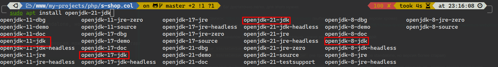
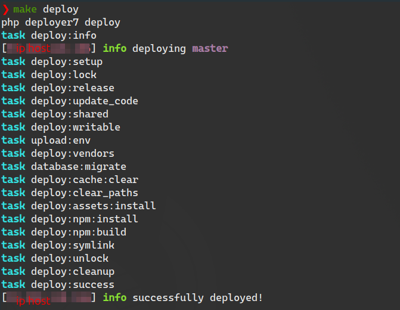

# Boutique en ligne sur Symfony

> [Aller sur le site](https://s-shop.alexanderyurchenko.ru/ "Aller sur le site")

## Choisissez la langue

| Русский  | English                              | Español                              | 中文                              | Français                              | Deutsch                              |
|----------|--------------------------------------|--------------------------------------|---------------------------------|---------------------------------------|--------------------------------------|
| [Русский](../../README.md) | [English](./README_en.md) | [Español](./README_es.md) | [中文](./README_zh.md) | **Sélectionné** | [Deutsch](./README_de.md) |

## Technologies utilisées

* Nginx 1.26.1
* PHP 8.3.9
* Composer 2.7.7
* PostgreSQL 16.3
* npm 10.8.2

## À propos du projet

Ce projet implémente une boutique en ligne utilisant **Symfony v6.4.9**. Certaines fonctionnalités sont réalisées avec **Vue 2.6** pour le panier et le panneau d'administration.

### Fonctionnalités principales

* Changement de langue
* Commandes console :
    * `php bin/console app:add-user` - création d'utilisateur
    * `php bin/console app:update-slug-product` - mise à jour du slug du produit

### Frontend

* inscription des visiteurs ;
* compte personnel ;
* récupération de mot de passe ;
* traitement des commandes avec notifications par email ;
* possibilité de s'authentifier et/ou de s'inscrire en utilisant : Yandex, Google, GitHub ou VKontakte.

### Partie administrative

* gestion des commandes et des utilisateurs ;
* création de catégories ;
* création de produits ;
* création de commandes.

## Installation du projet

1. Cloner le dépôt : `git clone git@github.com:yaleksandr89/symfony-shop.git`.
2. Renommer `.env-example` en `.env` :
    * Configurer `ADMIN_EMAIL` / `MAILER_DSN`, sinon la récupération de mot de passe et l'inscription ne fonctionneront pas correctement.
    * Configurer `OAUTH_GOOGLE_ID` / `OAUTH_GOOGLE_SECRET` - sinon l'authentification via Google ne fonctionnera pas.
    * Configurer `OAUTH_YANDEX_CLIENT_ID` / `OAUTH_YANDEX_CLIENT_SECRET` - sinon l'authentification via Yandex ne fonctionnera pas.
    * Configurer `OAUTH_VK_CLIENT_ID` / `OAUTH_VK_CLIENT_SECRET` - sinon l'authentification via VKontakte ne fonctionnera pas.
    * Configurer `OAUTH_GITHUB_EN_CLIENT_ID` / `OAUTH_GITHUB_SECRET` - sinon l'authentification via GitHub ne fonctionnera pas (localisation : en).
    * Configurer `OAUTH_GITHUB_RUS_CLIENT_ID` / `OAUTH_GITHUB_RUS_CLIENT_SECRET` - sinon l'authentification via GitHub ne fonctionnera pas (localisation : ru).
    * Configurer `SITE_BASE_HOST` / `SITE_BASE_SCHEME` - sinon les liens générés pour l'inscription, la récupération de mot de passe et les emails seront incorrects.
    * Configurer `APP_TIMEZONE` - spécifie le fuseau horaire utilisé par le projet. Par défaut, `APP_TIMEZONE=Europe/Moscow`, si vous souhaitez utiliser le fuseau horaire défini dans `php.ini`, laissez cette variable vide.
3. Exécutez : `composer i && npm i && npm run build`.
4. Créez la base de données : `php bin/console doctrine:database:create` ou `symfony doctrine:database:create` (si symfony cli est installé).
    * Le projet utilise `uuid_generate_v4` (SGBD PostgreSQL), donc avant la migration, connectez-vous à la base de données et exécutez :
        * Connectez-vous à la base de données choisie (`\c NOM DE LA BASE CRÉÉE`).
        * `CREATE EXTENSION "uuid-ossp";`.
        * Pour vérifier, exécutez `SELECT uuid_generate_v4();` - si un uuid est généré, vous pouvez procéder aux migrations.
5. Exécutez les migrations : `php bin/console doctrine:migrations:migrate` ou `symfony doctrine:migrations:migrate` (si symfony cli est installé).
6. Exécutez : `php bin/console assets:install` ou `symfony console assets:install` (si symfony cli est installé).
7. À ce stade, la partie frontend du site devrait fonctionner, mais pour accéder à l'admin, vous devez créer un utilisateur. Vous pouvez le faire via la commande créée :
    * `php bin/console app:add-user` ou `symfony console app:add-user` (si symfony cli est installé).
    * Indiquez l'email.
    * Indiquez le mot de passe (il ne sera pas affiché lors de la saisie).
    * Indiquez le rôle, pour l'admin, vous pouvez indiquer `ROLE_SUPER_ADMIN` (rôles disponibles : `ROLE_SUPER_ADMIN`, `ROLE_ADMIN`, `ROLE_USER`).

## Configuration de Messenger

Pour envoyer certains emails (récupération de mot de passe, confirmation de compte), [Symfony Messenger](https://symfony.com/doc/current/components/messenger.html "Symfony Messenger") est utilisé, donc vous devez exécuter la commande dans le terminal `symfony console messenger:consume async -vv`. L'exécution manuelle de la commande est appropriée au stade des tests, mais une fois vérifiée, il est recommandé de :

* attacher la commande à `cron`
* configurer `supervisor`

Exemple de configuration à placer dans `/etc/supervisor/conf.d/messenger-worker.conf` :

```
;/etc/supervisor/conf.d/messenger-worker.conf
[program:messenger-consume]
command=php /path/to/your/app/bin/console messenger:consume async --time-limit=3600
user=ubuntu
numprocs=2
startsecs=0
autostart=true
autorestart=true
process_name=%(program_name)s_%(process_num)02d
```


* `command=` - après `php`, spécifiez le chemin de la console et, après un espace, la commande à ajouter
* `user=` - spécifiez l'utilisateur actuel
* `numprocs=` - nombre de processus à créer

Les autres options peuvent rester inchangées. [Exemple de configuration](https://symfony.com/doc/6.4/messenger.html#supervisor-configuration) du site officiel.

### Tests

Le projet est couvert par différents types de tests (groupés par `#[Group(name: '{name}')]`) :

* tests unitaires
* tests d'intégration
* tests fonctionnels
* tests fonctionnels-panther
* tests fonctionnels-selenium

Les groupes de tests 1 à 3 doivent s'exécuter sans problème `php ./vendor/bin/phpunit --testdox --group unit --group integration --group functional`. Pour les deux derniers groupes, des problèmes peuvent survenir en raison de l'absence de [chromedriver](../../drivers/chromedriver) - moteur chrome ou [geckodriver](../../drivers/geckodriver) - moteur firefox.


Ces erreurs sont faciles à corriger, il suffit de télécharger le moteur : https://chromedriver.chromium.org/downloads (choisir en fonction de la version de Chrome). Vous pouvez essayer d'utiliser les moteurs que j'ai placés dans le répertoire **drivers/** du projet, mais si les versions du moteur et du navigateur installé diffèrent, des erreurs peuvent survenir.
Comment installer le moteur globalement dans le système (linux) : https://bangladroid.wordpress.com/2016/08/10/how-to-install-chrome-driver-in-linux-mint-selenium-webdriver/

Ensuite, avant de commencer les tests, vous devez lancer selenium avec la commande :

* `java -jar bin/selenium-server-4.22.0.jar standalone`
* `java -jar bin/selenium-server-standalone-3.141.59.jar` (ne nécessite pas le paramètre standalone, mais la version est plus ancienne)

Nécessite la présence de Java, qui peut être installé sur Ubuntu avec la commande : `sudo apt install openjdk-21-jdk`, la version peut varier - je prends toujours la dernière version.



## Deployment mit Deployer 7

[Deployer 7](https://deployer.org/docs/7.x/getting-started) ist ein Tool zur Automatisierung des Bereitstellungsprozesses von Anwendungen. Es ermöglicht das Definieren von Aufgaben und Sequenzen von Aktionen zum Bereitstellen von Code auf entfernten Servern. Dieses Repository verwendet Deployer 7 zur Automatisierung von Bereitstellungen.

### Konfiguration

Um Deployer 7 zu verwenden, müssen Sie die Datei `deploy.php` konfigurieren. Benennen Sie [deploy-example.php](deploy-example.php) in `deploy.php` um, überprüfen Sie die bereitgestellten Kommentare und füllen Sie die Datei gemäß Ihren Anforderungen aus. Es ist **zwingend erforderlich**, den Abschnitt `// Hosts` auszufüllen:

```php
// Hosts
host('...')
    ->setHostname('...')
    ->setPort('...')
    ->setRemoteUser('...')
    ->setIdentityFile('~/.ssh/....pub')
    ->set('labels', ['stage' => 'prod'])
    ->set('branch', '...')
    ->set('deploy_path', '...');
```

Verwendung

Zum Bereitstellen führen Sie `php deployer7.phar` deploy in der Konsole aus. Ein erfolgreicher Bereitstellungsprozess sieht etwa so aus:



## Mises à jour

* 08.07.2023 - fichier de configuration `.circleci` supprimé. Cessation de fonctionnement en Russie : https://support.circleci.com/hc/en-us/articles/360043679453-CircleCI-Terms-of-Service-Violation-Sanctioned-Country
* 08.07.2023 - Symfony mis à jour vers la dernière version à cette date, `6.3.1`
* 17.07.2024 - Symfony mis à jour vers la version `6.4.9`
* 17.07.2024 - Tests unitaires mis à jour vers la version 11, refactorisation des tests eux-mêmes
* Ajout de la configuration pour [nginx](../conf/nginx/s-shop.conf) et [supervisor](../conf/supervisor/messenger-worker.conf), ainsi que diverses traductions pour README.md
