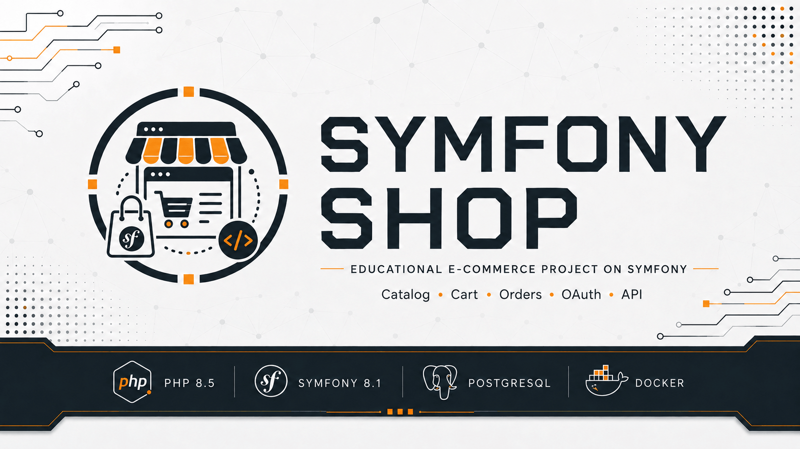

# Symfony Shop

[](https://github.com/yaleksandr89/symfony-shop)
[](https://github.com/yaleksandr89/symfony-shop/actions/workflows/basic.yml)
[](https://www.php.net/)
[](https://symfony.com/)
[](https://www.postgresql.org/)
[](https://www.docker.com/)
[](../../LICENSE.md)

<p align="center">
  
</p>

## 选择语言

| Русский | English | Español | 中文 | Français | Deutsch |
|---|---|---|---|---|---|
| [Русский](../../README.md) | [English](README_en.md) | [Español](README_es.md) | **已选择** | [Français](README_fr.md) | [Deutsch](README_de.md) |

Symfony Shop 是一个基于 Symfony 的教学型在线商店项目。项目包含商品目录、购物车与结账、用户账户、管理后台、API 以及 OAuth 登录。大部分页面由 Twig 渲染，Vue 2 仅用于部分交互式界面元素。

受支持的本地开发环境基于 Docker Compose。PHP、Composer、Node.js、PostgreSQL 和 Chrome for Testing 在容器中运行或安装到 Docker 镜像中，主要操作统一通过 Makefile 提供。项目不支持将 PHP、Composer 和 PostgreSQL 直接安装在宿主机上的运行方式，CI 也不会验证这种场景。

## 功能

- 带图片、新品和折扣的分类与商品目录；
- 带可用性检查的购物车和订单结账；
- 注册、登录、邮箱验证和密码重置；
- 用户账户；
- 通过 Google、Yandex、VKontakte、GitHub、Facebook 和 LinkedIn 使用 OAuth；
- OAuth 登录、外部账户绑定和解绑使用独立流程；
- 用户、分类、商品和订单管理；
- 基于 API Platform 的 API；
- 单元、集成、功能和浏览器测试；
- GitHub Actions CI 使用与本地开发相同的 Docker 环境。

## 快速开始

宿主机需要 Git、Make 和支持 Compose 的 Docker。正常克隆仓库时推荐使用 Git LFS；大型浏览器归档也可以在不安装 Git LFS 的情况下获取。

> [!NOTE]
> Make 是 Unix 类系统中的常用命令行工具。在 Linux 和 macOS 上可以直接从终端运行项目。在 Windows 上推荐使用 WSL2 配合 Docker Desktop。

| 命令 | 作用 | 说明 |
|---|---|---|
| `git clone https://github.com/yaleksandr89/symfony-shop.git` | 克隆仓库 | |
| `cd symfony-shop` | 进入项目目录 | |
| `git lfs install` | 启用 Git LFS | 仅 Git LFS 场景需要 |
| `git lfs pull` | 下载 Chrome for Testing | 在 `make build` 之前执行 |
| `make init` | 创建 `.env.docker` 和本地目录 | 不覆盖已有 `.env.docker` |
| `make build` | 构建 PHP 镜像 | 镜像内含 Panther 所需的 Chrome 和 Chromedriver |
| `make up` | 启动 PHP-FPM、Nginx 和 PostgreSQL | |
| `make composer-install` | 从 `composer.lock` 安装 PHP 依赖 | 宿主机无需 Composer |
| `make npm-install` | 从 `package-lock.json` 安装依赖 | 宿主机无需 Node.js |
| `make assets-build` | 构建前端资源 | |
| `make migrate` | 应用 Doctrine migrations | |
| `make demo-init` | 创建演示数据 | 仅用于本地 `dev`/`test` 环境 |

启动后，应用默认可通过 [http://localhost:8080](http://localhost:8080) 访问。

> [!IMPORTANT]
> 项目固定使用 Chrome for Testing `150.0.7871.46`。推荐通过 `git lfs pull` 获取归档。从 `v3.0.0` 开始，可以从 [Releases](https://github.com/yaleksandr89/symfony-shop/releases) 下载已经包含 Chrome for Testing 的项目 ZIP，因此这种方式不需要 Git LFS。固定版本也可以直接从官方来源下载。精确链接、文件名和 SHA-256 见[启动指南](../getting-started.md#git-lfs-и-chrome-for-testing)。

> [!IMPORTANT]
> `.env.docker` 中的值会作为进程环境变量传入 PHP 容器。如果同一个键同时存在于 `.env.docker` 和 `.env.local`，则 `.env.docker` 的值优先。完整优先级规则见[配置指南](../configuration.md#приоритет-переменных)。

> [!WARNING]
> `make demo-init` 会重新创建演示订单。不要在包含需要保留数据的本地数据库上运行它。

完整的首次启动流程、获取 Chrome for Testing 的三种方式以及容器管理命令见[启动指南](../getting-started.md)。

## 邮件与消息队列

默认值为 `MAILER_DSN=null://null`，因此应用不会通过外部 SMTP 服务发送邮件。在 HTTP 请求中同步发送的邮件可以在 Symfony Profiler 的 Mailer 面板中查看。

注册和密码重置使用 Messenger 的 `async` transport。队列路由已经配置，但 Docker Compose 目前不会启动常驻 worker，因此这些消息只有在手动运行以下命令后才会处理：

```text
make console CMD='messenger:consume async -vv'
```

transport、邮件和本地 secret 的配置见[配置指南](../configuration.md#почта-и-messenger)。

## OAuth

OAuth 登录与把外部账户绑定到已有用户是两个不同的操作。Provider 返回相同 email 并不足以自动把外部身份绑定到已有本地账户。

绑定账户时，用户先通过普通方式登录，确认当前密码，然后从账户页面明确启动 OAuth 流程。解绑同样受当前密码和 CSRF token 保护。

支持的 provider、环境变量、路由和安全规则见 [OAuth 指南](../oauth.md)。本地配置和 secret 的通用规则见[配置指南](../configuration.md)。

## 项目结构

```text
浏览器
  ↓
Nginx
  ↓
Symfony
  ├─ Controller → Twig → HTML
  └─ API Platform → JSON API
  ↓
应用服务 / Doctrine
  ↓
PostgreSQL
```

主要代码按 `Account`、`Catalog` 和 `Commerce` 划分。管理后台、OAuth 和 SEO 作为内部 Symfony bundle 实现。Vue 2 只用于部分交互式组件，而不是独立 SPA。

目录结构、路由、API Platform、Doctrine 和前端边界见[架构指南](../architecture.md)。

## 检查

| 命令 | 作用 | 说明 |
|---|---|---|
| `make check` | 运行 ESLint、PHP-CS-Fixer 检查和 PHPStan | 不包含测试 |
| `make test-unit` | 运行单元测试 | |
| `make test-integration` | 运行集成测试 | |
| `make test-functional` | 运行功能测试 | |
| `make test-functional-panther` | 使用 Panther 运行浏览器测试 | Chrome 已包含在 PHP 镜像中 |
| `make test-all CONFIRM=testdb` | 运行全部测试 | 会重新创建测试数据库 |
| `make coverage CONFIRM=testdb` | 在终端显示 PHP/PHPUnit 覆盖率 | 不包含 Panther |
| `make coverage-html CONFIRM=testdb` | 生成 HTML 和 Clover 报告 | `var/coverage/html`, `var/coverage/clover.xml` |

完整 Make 命令、测试数据库流程和 CI 组成见[开发指南](../development.md)。

## 计划

1. **本地邮件环境。** 增加带 Web 界面的邮件服务和常驻 Messenger worker，使 `async` transport 中的消息能够自动处理。
2. **Inertia.js 与 Vue 3.** 将服务端与客户端交互迁移到 Inertia.js 和 Vue 3。同时我也想重新评估本地化方案：根据改动规模，也许可以取消 URL 中强制的 `/{_locale}` 前缀。这个决定会在新前端设计阶段做出。
3. **管理后台。** 完成前端迁移后，大幅扩展管理界面的商店管理能力。

## 反馈

- 可复现的错误 — [GitHub Issues](https://github.com/yaleksandr89/symfony-shop/issues)；
- 问题和想法 — [GitHub Discussions](https://github.com/yaleksandr89/symfony-shop/discussions)。

## 项目历史

### 2026 — 准备 v3.0.0

- Docker Compose 成为主要开发环境。项目加入统一 Makefile、可复现 bootstrap、Docker 中的 PostgreSQL、演示数据、Xdebug 和 APCu。
- CI 迁移到 GitHub Actions，并使用与本地开发相同的 Docker 流程。
- Backend stack 逐步升级到 PHP 8.5、Symfony 8.1、API Platform 4.3、Doctrine ORM 3 / DBAL 4、PHPUnit 13 和 PHPStan 2。
- 购物车、结账、API、注册、密码重置和 OAuth 的安全与业务边界被大幅重构。
- OAuth 增加 Facebook 和 LinkedIn；登录、注册、绑定和解绑成为独立且受专门检查保护的流程。
- Selenium、GeckoDriver、Java tooling 和 Deployer 被移除。浏览器测试迁移到 Panther 与 Chrome for Testing；Chrome 归档通过 Git LFS 存储。
- 应用架构围绕 `Account`、`Catalog`、`Commerce` 以及 `AdminBundle`、`OAuthBundle`、`SeoBundle` 重新组织；路由和共用 OAuth callback 流程被集中管理。
- 测试基础设施重新搭建，加入 Docker-backed quality gates 和覆盖率命令。
- 项目文档完全重写，增加启动、配置、开发、OAuth 和架构指南。
- 项目许可证统一为 MIT；加入 GitHub Issues/Discussions、Pull Request 模板、贡献指南和安全策略。

### 2024 — v2.3.0

- Symfony 升级到 6.4.9。
- PHPUnit 从 9 升级到 11，DAMA Doctrine Test Bundle 升级到 8；现有测试被重构。
- 继续从 annotation 迁移到 PHP attribute，并清理 PHPStan 问题。
- Selenium、ChromeDriver 和 GeckoDriver 更新。
- 增加 Nginx、Supervisor 示例、Deployer 指南和 README 翻译。

### 2023 — v2.1.1 / v2.2.0

- Symfony 升级到 6.3.1，更新依赖，并清理项目自身代码中的 deprecation 提示。
- 完成新一轮重构和 PHPStan 清理。
- 更新 Deployer 配置。
- CircleCI 在停止向俄罗斯用户提供服务后被移除。

### 2022 — v1.2.0 / v2.0.0 / v2.1.0

- 建立在线商店的主要功能。
- 增加 Google、Yandex、VKontakte 和 GitHub OAuth 登录。
- Symfony 从 5.4 逐步升级到 6.0。
- 用户账户支持绑定和解绑外部 OAuth 账户。
- 增加防止同一外部身份被多个本地用户重复使用的保护。

### 2021 — 项目开始

- 基于 Symfony 5.3 和 PostgreSQL 创建第一版 Symfony Shop。

---

<p align="center">
  如果这个项目对你有帮助，请在 GitHub 上点个 Star，这样其他开发者也更容易发现它。 🤘
</p>
