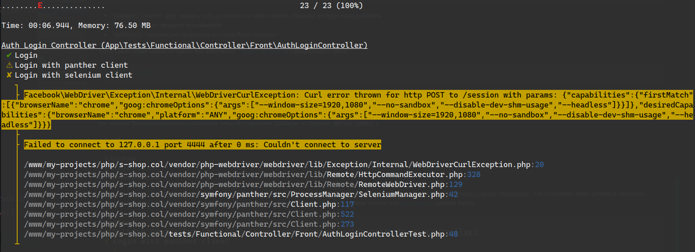

# 基于 Symfony 的在线商店

> [访问网站](https://s-shop.alexanderyurchenko.ru/ "访问网站")

## 选择语言

| Русский  | English                              | Español                              | 中文                              | Français                              | Deutsch                              |
|----------|--------------------------------------|--------------------------------------|---------------------------------|---------------------------------------|--------------------------------------|
| [Русский](../../README.md) | [English](./docs/langs/README_en.md) | [Español](./docs/langs/README_es.md) | 已选择 | [Français](./docs/langs/README_fr.md) | [Deutsch](./docs/langs/README_de.md) |

## 使用技术

* Nginx 1.26.1
* PHP 8.3.9
* Composer 2.7.7
* PostgreSQL 16.3
* npm 10.8.2

## 关于项目

该项目使用 **Symfony v6.4.9** 实现了一个在线商店。部分功能使用 **Vue 2.6** 实现，用于购物车和管理面板。

### 主要功能

* 语言切换
* 控制台命令：
    * `php bin/console app:add-user` - 创建用户
    * `php bin/console app:update-slug-product` - 更新产品 slug

### 前端

* 访客注册；
* 个人账户；
* 密码恢复；
* 通过电子邮件通知进行订单处理；
* 用户可以使用 Yandex、Google、GitHub 或 VKontakte 登录或注册。

### 管理部分

* 订单和用户管理；
* 创建分类；
* 创建产品；
* 创建订单。

## 项目安装

1. 克隆仓库：`git clone git@github.com:yaleksandr89/symfony-shop.git`。
2. 重命名 `.env-example` 为 `.env`：
    * 配置 `ADMIN_EMAIL` / `MAILER_DSN`，否则密码恢复功能和用户注册流程将无法完成。
    * 配置 `OAUTH_GOOGLE_ID` / `OAUTH_GOOGLE_SECRET` - 否则 Google 登录将无法使用。
    * 配置 `OAUTH_YANDEX_CLIENT_ID` / `OAUTH_YANDEX_CLIENT_SECRET` - 否则 Yandex 登录将无法使用。
    * 配置 `OAUTH_VK_CLIENT_ID` / `OAUTH_VK_CLIENT_SECRET` - 否则 VKontakte 登录将无法使用。
    * 配置 `OAUTH_GITHUB_EN_CLIENT_ID` / `OAUTH_GITHUB_SECRET` - 否则 GitHub 登录将无法使用（语言：en）。
    * 配置 `OAUTH_GITHUB_RUS_CLIENT_ID` / `OAUTH_GITHUB_RUS_CLIENT_SECRET` - 否则 GitHub 登录将无法使用（语言：ru）。
    * 配置 `SITE_BASE_HOST` / `SITE_BASE_SCHEME` - 否则注册、密码恢复和电子邮件中的链接将生成错误的链接。
    * 配置 `APP_TIMEZONE` - 指定项目使用的时区。默认值为 `APP_TIMEZONE=Europe/Moscow`，如果您希望使用 `php.ini` 中指定的时区，请将该变量留空。
3. 执行：`composer i && npm i && npm run build`。
4. 创建数据库：`php bin/console doctrine:database:create` 或 `symfony doctrine:database:create`（如果安装了 symfony cli）。
    * 项目使用 `uuid_generate_v4`（PostgreSQL 数据库），所以在迁移之前，连接到数据库并执行：
        * 连接到所选数据库 (`\c 创建的数据库名`)。
        * `CREATE EXTENSION "uuid-ossp";`。
        * 为了检查，可以执行 `SELECT uuid_generate_v4();` - 如果生成了 uuid，则可以开始迁移。
5. 执行迁移：`php bin/console doctrine:migrations:migrate` 或 `symfony doctrine:migrations:migrate`（如果安装了 symfony cli）。
6. 执行：`php bin/console assets:install` 或 `symfony console assets:install`（如果安装了 symfony cli）。
7. 之后，网站前端部分应该可以运行，但要访问管理后台，需要创建一个用户。这可以通过以下命令完成：
    * `php bin/console app:add-user` 或 `symfony console app:add-user`（如果安装了 symfony cli）。
    * 输入电子邮件。
    * 输入密码（输入时不会显示）。
    * 输入角色，对于管理员可以输入 `ROLE_SUPER_ADMIN`（可用角色：`ROLE_SUPER_ADMIN`，`ROLE_ADMIN`，`ROLE_USER`）。

## Messenger 配置

为了发送某些邮件（密码恢复、账户确认），使用了 [Symfony Messenger](https://symfony.com/doc/current/components/messenger.html "Symfony Messenger")，因此需要在终端执行命令 `symfony console messenger:consume async -vv`。在测试阶段，手动执行该命令是合适的，但在所有功能验证后，建议：

* 将命令挂在 `cron` 上
* 配置 `supervisor`

在 `/etc/supervisor/conf.d/messenger-worker.conf` 中放置以下配置示例：

```
;/etc/supervisor/conf.d/messenger-worker.conf
[program:messenger-consume]
command=php /path/to/your/app/bin/console messenger:consume async --time-limit=3600
user=ubuntu
numprocs=2
startsecs=0
autostart=true
autorestart=true
process_name=%(program_name)s_%(process_num)02d
```

* `command=` - 在 `php` 之后指定控制台路径和要添加的命令
* `user=` - 指定当前用户
* `numprocs=` - 将创建的进程数

其他选项可以保持不变。[官方示例配置](https://symfony.com/doc/6.4/messenger.html#supervisor-configuration)。

### 测试

项目包含了各种类型的测试（按组划分 `#[Group(name: '{name}')]`）：

* 单元测试
* 集成测试
* 功能测试
* 功能测试-潘多拉
* 功能测试-Selenium

组 1 到 3 的测试应该没有问题 `php ./vendor/bin/phpunit --testdox --group unit --group integration --group functional`。对于最后两个组，测试过程中可能会因为缺少 [chromedriver](../../drivers/chromedriver) - Chrome 驱动程序或 [geckodriver](../../drivers/geckodriver) - Firefox 驱动程序而出现问题。




这些错误很容易修复，只需下载驱动程序：https://chromedriver.chromium.org/downloads（根据 Chrome 版本选择）。您也可以尝试使用我在项目中的 **drivers/** 目录中放置的驱动程序，但如果驱动程序版本与安装的浏览器版本不同，可能会出现错误。
在系统中（Linux）全局安装驱动程序的方法：https://bangladroid.wordpress.com/2016/08/10/how-to-install-chrome-driver-in-linux-mint-selenium-webdriver/

之后，在开始测试之前，需要使用以下命令启动 selenium：

* `java -jar bin/selenium-server-4.22.0.jar standalone`
* `java -jar bin/selenium-server-standalone-3.141.59.jar`（不需要指定 standalone 参数，但版本较旧）

需要安装 Java，在 Ubuntu 上可以使用命令安装：`sudo apt install openjdk-21-jdk`，版本可能会有所不同 - 我总是安装最新版本。


## 更新日志

* 2023-07-08 - 删除了 `.circleci` 配置。由于在俄罗斯不再可用：https://support.circleci.com/hc/en-us/articles/360043679453-CircleCI-Terms-of-Service-Violation-Sanctioned-Country
* 2023-07-08 - Symfony 更新至最新版本 `6.3.1`
* 2024-07-17 - Symfony 更新至版本 `6.4.9`
* 2024-07-17 - 单元测试更新至版本 11，并对测试进行了重构
* 添加了 [nginx](../conf/nginx/s-shop.conf) 和 [supervisor](../conf/supervisor/messenger-worker.conf) 的配置文件，以及 README.md 的各种翻译
